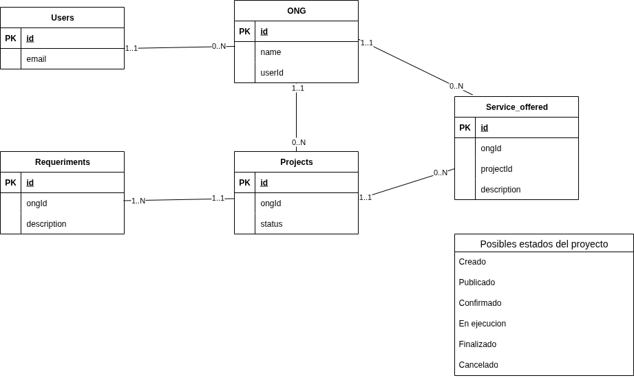

# Desarrollo de Software en Sistemas Distribuidos

Repositorio con el trabajo de la materia Desarrollo de Software en Sistemas Distribuidos

- [Desarrollo de Software en Sistemas Distribuidos](#desarrollo-de-software-en-sistemas-distribuidos)
  - [Diagrama de entidad relación](#diagrama-de-entidad-relación)

## Diagrama de entidad relación

Primer paneo general de como podría verse el sistema. Principalmente para identificar actores y ver los estados de los proyectos.

